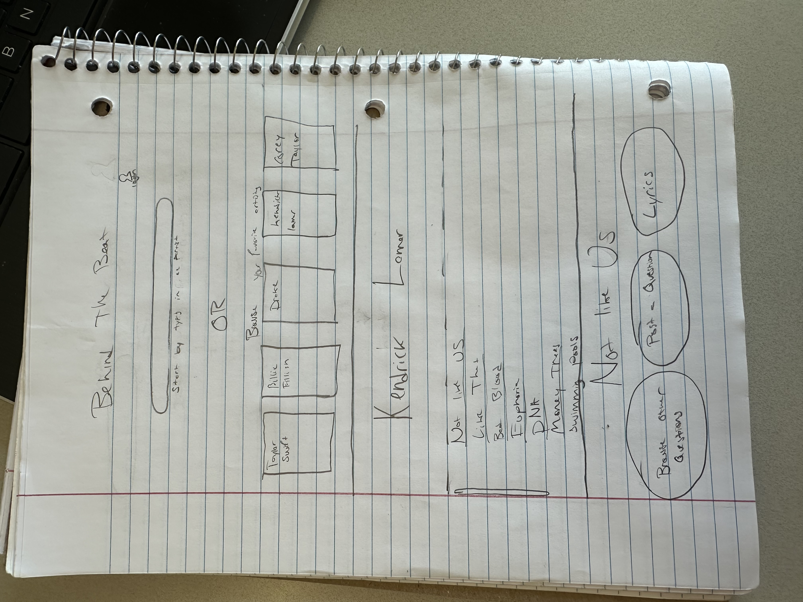

# Behindthebeat

Have you ever been listening to a song and wondered, *What did they really mean by that?* Maybe you’ve even googled the lyrics, only to come up empty-handed. 

While you love your favorite artists, sometimes there just isn’t enough information out there about their songs—until now. Introducing Behindthebeat. The platform where music lovers connect to share their interpretations, discuss lyrics, and ask questions about their favorite tracks. Whether you're looking for insights from others or ready to share your own, **behindthebeat** gives you a space to dive deeper into the music you love.

## Design

 

# Behindthebeat

## Key Features

- **Secure login over HTTPS**: Ensure user data is protected with secure connections.
- **Post questions for other listeners to discuss**: Engage with the community by asking questions about songs.
- **View artist profiles and their music catalog**: Explore artist information and their complete list of songs.
- **Read and interact with answers from the community**: Like, comment, and save interactions from other users.
- **Search for artists or songs easily**: Quickly find the music or artists you're interested in.
- **View song lyrics**: Read the lyrics of your favorite songs.
- **Undo likes and delete comments**: Manage your interactions and comments on the platform.
- **Save favorite listeners for easy reference**: Keep track of users whose opinions you value.
- **Real-time updates on likes and comments**: See changes instantly as interactions occur.

## Technologies

- **HTML (Basic structural and organizational elements)**:
  - Create the layout of the pages (e.g., homepage, artist pages, song pages).
  - Set up the structure for forms (e.g., login form, comment form).
  - Display text elements like song lyrics, questions, comments, and user information.

- **CSS (Styling and animating)**:
  - Design the look of the website (colors, fonts, layout).
  - Create responsive layouts that look good on mobile and desktop.
  - Add animations for things like hover effects on buttons or fading in new comments.

- **JavaScript (Interactivity)**:
  - Handle basic interactivity on the site, including:
    - What happens when users click buttons (e.g., submit a question, like a comment).
    - Validating forms for user login or registration.
    - Displaying pop-ups or modals (e.g., confirmation when deleting a comment or taking back a like).

- **React (Reactivity, components, and routing using the React web framework)**:
  - Build components like login forms, artist lists, song details, and comment sections.
  - Manage routing between different pages, like navigating between artist profiles and song lyric pages.
  - Reactivity: Automatically update the UI when new comments or likes are submitted.

- **Web Service (Remote functions that your application calls on your, and someone else’s, web server)**:
  - Handling user registration, login, posting questions, fetching comments, and managing likes.
  - API: Fetch song details or lyrics. For example, the Genius API could provide song lyrics and artist information.

- **Authentication (User account creation and login)**:
  - Create forms for user registration and login.
  - Store the user’s session and display their name at the top of the page or in the navigation bar.
  - Restrict actions like liking or commenting to authenticated users.

- **Database Data (Rendering of application data stored in the database)**:
  - Retrieve and display stored data like:
    - List of artists, song information, and user comments.
    - User information like saved favorite listeners and account data.
  - The database will store this information, and the web service will fetch it to display to users.

- **WebSocket Data (Real-time data updates from your server)**:
  - WebSockets will allow for real-time updates when other users submit comments or likes.
  - If a user likes a comment, it will immediately update for all users viewing that comment without needing a refresh.
  - Similarly, when a new comment is posted on a song, it will appear in real-time for others on that page.

## HTML Deliverable

For this deliverable, I built out the structure of my application using HTML.

- [x] **HTML pages** - Two HTML pages that represent the ability to log in and browse artists.
- [x] **Links** - The home page links directly to the artists page, which contains links for a few of their top songs.
- [x] **Text** - There is text showing people what to do in the search bar and instructions on each page for user interaction.
- [x] **Images** - There are images within each of the suggested artists' pages.
- [x] **DB/Login** - The login page features an input box for username/password and a submit button to authenticate users. The artists and songs represent data pulled from a database.
- [x] **WebSocket** - The users' comments are updated in real-time, reflecting the comments and likes through WebSocket integration.
- [X] **3rd party Web Service** - There should be a place holder now but it doesn't pull artists yet.

## CSS Deliverable

For this deliverable, I built out the style of my application using CSS.

- [x] Responsive Design - The application layout is responsive across different screen sizes, adapting elements for desktop, tablet, and mobile views.
- [x] Navigation Bar - The navigation bar is styled with custom colors, padding, and hover effects, ensuring it looks clean and consistent on all pages.
- [x] Carousel - The carousel component is styled with custom captions, ensuring the backdrop resizes dynamically with the text while maintaining smooth transitions between images.
- [x] Text Styling - Fonts and text colors are customized, and the layout adjusts text size depending on the screen width to enhance readability.
- [x] Buttons and Forms - Buttons are styled for consistency, with hover effects and margin adjustments for a polished user interaction.

## React Deliverable

For this deliverable, I built out the functionality and structure of my application using React.

- [x] Component-Based Architecture - The application is structured with reusable components, each managing its own logic and style, which makes the application modular and easier to maintain.
- [x] State Management - State is managed using React's useState and useEffect hooks, allowing for dynamic data updates and side effects (e.g., data fetching and event handling) to be managed effectively within each component.
- [x] Props Passing - Data is passed between components using props, enabling components to receive and display dynamic information, ensuring consistency across the application.
- [x] Conditional Rendering - Components are rendered conditionally based on the state, allowing the application to display appropriate messages, loading indicators, or alternative views when data is unavailable.
- [x] Event Handling - Interactive functionality is implemented through event handlers on buttons, forms, and other UI elements, allowing for responsive and seamless user interaction throughout the application.
- [x] Form Handling - Forms are created with state-bound inputs to capture and process user input efficiently, improving the user experience by providing real-time feedback.

